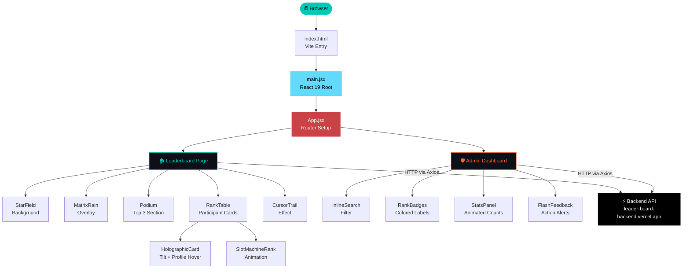

<div align="center">

```
███████╗██████╗  ██████╗ ███╗   ██╗████████╗███████╗███╗   ██╗██████╗ 
██╔════╝██╔══██╗██╔═══██╗████╗  ██║╚══██╔══╝██╔════╝████╗  ██║██╔══██╗
█████╗  ██████╔╝██║   ██║██╔██╗ ██║   ██║   █████╗  ██╔██╗ ██║██║  ██║
██╔══╝  ██╔══██╗██║   ██║██║╚██╗██║   ██║   ██╔══╝  ██║╚██╗██║██║  ██║
██║     ██║  ██║╚██████╔╝██║ ╚████║   ██║   ███████╗██║ ╚████║██████╔╝
╚═╝     ╚═╝  ╚═╝ ╚═════╝ ╚═╝  ╚═══╝   ╚═╝   ╚══════╝╚═╝  ╚═══╝╚═════╝ 
                  ✦  B U G B Y T E  2 0 2 6  ✦  I G N I T E  C L U B  ✦
```

### 🌌 A deep-space leaderboard UI — where every rank feels like a launch

<br/>

[](https://react.dev/)
[](https://vitejs.dev/)
[](https://tailwindcss.com/)
[](https://daisyui.com/)
[](https://reactrouter.com/)

<br/>

[](https://leader-board-frontend-two.vercel.app)
[](https://backend-cybersericuty-n23j.onrender.com/admin)
[](https://leader-board-backend.vercel.app)

<br/>

[](https://github.com/aarav12e/LeaderBoard_Frontend/stargazers)
[](https://github.com/aarav12e/LeaderBoard_Frontend/commits/main)
[](LICENSE)

</div>

---

## 🛸 What is This?

**LeaderBoard Frontend** is the visual powerhouse behind **BugByte 2026** — Ignite Club's flagship competitive programming contest. It's not just a leaderboard. It's an *experience*.

Built with a **deep space aesthetic** — animated starfields, matrix rain, holographic tilt cards, podium effects, and slot machine rank animations — this UI makes every rank feel earned and every update feel cinematic.

> Ranked. Animated. Deployed. Out of this world.

---

## ✨ Features & UI Highlights

| Feature | Description |
|--------|-------------|
| 🌌 **Deep Space Theme** | Dark background with cyan/teal accents, galactic atmosphere |
| ⭐ **Animated Starfield** | Procedural star particle system in the background |
| 🟩 **Matrix Rain Effect** | Falling character rain overlay inspired by The Matrix |
| 🏆 **Podium Section** | Animated top-3 winner podium with special styling |
| 🃏 **Holographic Tilt Cards** | 3D perspective-tilt hover effect on participant cards |
| 🎰 **Slot Machine Rank Anim** | Rank numbers animate like a slot machine on update |
| 👤 **Hover Profile Cards** | Rich participant info revealed on card hover |
| 🖱️ **Cursor Trail Effect** | Custom glowing cursor trail throughout the UI |
| 🔍 **Inline Admin Search** | Real-time search filter in the Admin Dashboard |
| 🎨 **Rank-Colored Badges** | Dynamic badge colors based on participant ranking |
| ⚡ **Flash Feedback** | Instant visual feedback on admin actions |
| 📊 **Animated Stats** | Live-animated stat counters in Admin Dashboard |
| 🔔 **Toast Notifications** | Sleek hot-toast alerts for all user interactions |
| 📱 **Fully Responsive** | Works seamlessly across desktop and mobile |

---

## 🏗️ Component Architecture



---

## 🎨 Design System

```
  DEEP SPACE PALETTE
  ──────────────────────────────────────────────
  Background    #050a14   ████  Void Black
  Primary       #00C7B7   ████  Cyber Teal
  Accent        #6EE7F7   ████  Neon Cyan
  Warning       #FFD700   ████  Gold (rank 1)
  Silver        #C0C0C0   ████  Silver (rank 2)
  Bronze        #CD7F32   ████  Bronze (rank 3)
  Admin Accent  #FF6B35   ████  Solar Orange
  Text Primary  #E0E0E0   ████  Starlight
  Text Muted    #7B8CA0   ████  Nebula Grey
  ──────────────────────────────────────────────

  TYPOGRAPHY
  ──────────────────────────────────────────────
  Display   →  Orbitron        (futuristic headers)
  Mono      →  Share Tech Mono (code / scores / ranks)
  ──────────────────────────────────────────────
```

---

## 🛠️ Tech Stack

| Layer | Technology | Purpose |
|-------|-----------|---------|
| **UI Library** |  | Component-based rendering |
| **Build Tool** |  | Lightning-fast dev + production build |
| **Styling** |  | Utility-first CSS |
| **UI Components** |  | Pre-built accessible component library |
| **Routing** |  | Client-side navigation |
| **HTTP Client** |  | Backend API communication |
| **Notifications** |  | Lightweight toast alert system |
| **Linting** |  | Code quality enforcement |
| **Deploy** |  | Serverless frontend hosting |

---

## 📁 Project Structure

```
LeaderBoard_Frontend/
│
├── 📂 public/
│   └── favicon, static assets
│
├── 📂 src/
│   ├── 📂 components/
│   │   ├── StarField.jsx          # Animated star particle background
│   │   ├── MatrixRain.jsx         # Matrix falling chars overlay
│   │   ├── Podium.jsx             # Top-3 winner podium section
│   │   ├── HolographicCard.jsx    # 3D tilt participant card
│   │   ├── SlotMachineRank.jsx    # Animated rank counter
│   │   ├── CursorTrail.jsx        # Glowing cursor trail effect
│   │   └── ...
│   │
│   ├── 📂 pages/
│   │   ├── Leaderboard.jsx        # Main public leaderboard view
│   │   └── AdminDashboard.jsx     # Protected admin control panel
│   │
│   ├── 📂 api/
│   │   └── axios.js               # Axios instance with base URL config
│   │
│   ├── App.jsx                    # Root router + layout
│   └── main.jsx                   # React DOM entry point
│
├── 📄 index.html                  # Vite HTML template
├── 📄 vite.config.js              # Vite + React plugin config
├── 📄 tailwind.config.js          # TailwindCSS v4 config
├── 📄 eslint.config.js            # ESLint flat config
├── 📄 vercel.json                 # Vercel SPA routing config
└── 📄 package.json
```

---

## ⚡ Data Flow

```
  👤 User Opens App
        │
        ▼
  ┌─────────────────┐
  │  Vite Dev/Build  │  ← Bundles React + Tailwind
  └────────┬────────┘
           │
           ▼
  ┌─────────────────┐
  │  React Router   │  ← Routes: / (Leaderboard), /admin
  └────────┬────────┘
           │
           ▼
  ┌─────────────────┐
  │  Axios Request  │  ← GET /api/leaderboard
  └────────┬────────┘
           │
           ▼
  ┌─────────────────────────────┐
  │  leader-board-backend.vercel│  ← Express + MongoDB
  └────────┬────────────────────┘
           │
           ▼
  ┌─────────────────┐
  │  React State    │  ← useState / props update
  └────────┬────────┘
           │
           ▼
  ┌─────────────────┐
  │  Animated UI    │  ← Tilt cards, slot ranks, podium
  └─────────────────┘
```

---

## ⚙️ Environment Variables

Create a `.env` file in the root:

```env
# ─── Backend API ────────────────────────────────
VITE_API_BASE_URL=https://leader-board-backend.vercel.app

# ─── Admin Config (if applicable) ──────────────
VITE_ADMIN_SECRET=your_admin_token_here
```

> ⚠️ All Vite env variables **must** be prefixed with `VITE_` to be exposed to the browser.

---

## 🚀 Getting Started

### Prerequisites

```bash
node --version   # v18+ required
npm --version    # v9+ recommended
```

### Installation & Dev

```bash
# 1. Clone the repository
git clone https://github.com/aarav12e/LeaderBoard_Frontend.git
cd LeaderBoard_Frontend

# 2. Install dependencies
npm install

# 3. Set up environment variables
cp .env.example .env
# → Fill in VITE_API_BASE_URL

# 4. Fire up the dev server
npm run dev
```

The app launches at `http://localhost:5173` 🚀

### Build for Production

```bash
npm run build       # Outputs to /dist
npm run preview     # Preview the production build locally
```

---

## 🗺️ Pages & Routes

| Route | Page | Description |
|-------|------|-------------|
| `/` | `Leaderboard` | Public deep-space ranked leaderboard |
| `/admin` | `AdminDashboard` | Admin panel — add, update, delete participants |

---

## ☁️ Deployment

Auto-deployed to **Vercel** on every push to `main`.

```
📦 git push origin main
        │
        ▼
🔁 Vercel detects changes
        │
        ▼
⚡ vite build
        │
        ▼
🌐 Live at leader-board-frontend-two.vercel.app
```

The `vercel.json` handles SPA routing — all paths redirect to `index.html` so React Router works properly on refresh.

```json
{
  "rewrites": [{ "source": "/(.*)", "destination": "/index.html" }]
}
```

### Deploy your own fork

```bash
npm i -g vercel
vercel login
vercel --prod
```

> Set `VITE_API_BASE_URL` in **Vercel Dashboard → Settings → Environment Variables**.

---

## 📦 Dependencies

### Runtime

```json
{
  "react":           "^19.2.0",   // UI component framework
  "react-dom":       "^19.2.0",   // DOM renderer
  "react-router-dom":"^7.13.0",   // Client-side routing
  "axios":           "^1.13.5",   // HTTP requests to backend
  "react-hot-toast": "^2.6.0"    // Toast notification system
}
```

### Dev / Build

```json
{
  "vite":             "^7.2.4",    // Build tool & dev server
  "tailwindcss":      "^4.1.18",   // Utility CSS
  "daisyui":          "^5.5.18",   // Component library
  "@vitejs/plugin-react": "^5.1.1",// React Fast Refresh
  "eslint":           "^9.39.1"    // Code linting
}
```

---

## 🤝 Contributing

```bash
# Fork → Clone → Branch
git checkout -b feature/your-feature

# Make changes & commit
git commit -m "feat: your feature description"

# Push & open PR
git push origin feature/your-feature
```

---

## 🔗 Related Repos

| Repo | Description | Link |
|------|-------------|------|
| **LeaderBoard_Backend** | Express + MongoDB REST API | [aarav12e/LeaderBoard_Backend](https://github.com/aarav12e/LeaderBoard_Backend) |
| **LeaderBoard_Frontend** | This repo — React + Vite UI | [aarav12e/LeaderBoard_Frontend](https://github.com/aarav12e/LeaderBoard_Frontend) |

---

## 👨‍💻 Author

<div align="center">

**Aarav Kumar**
*Frontend Developer · Ignite Club · BugByte 2026*

[](https://github.com/aarav12e)

</div>

---

<div align="center">

```
✦ ✦ ✦  The stars don't rank themselves.  ✦ ✦ ✦
```

*Crafted with 🌌 for the competitive programmers of BugByte 2026*

**`< / Ignite Club >`**

</div>

